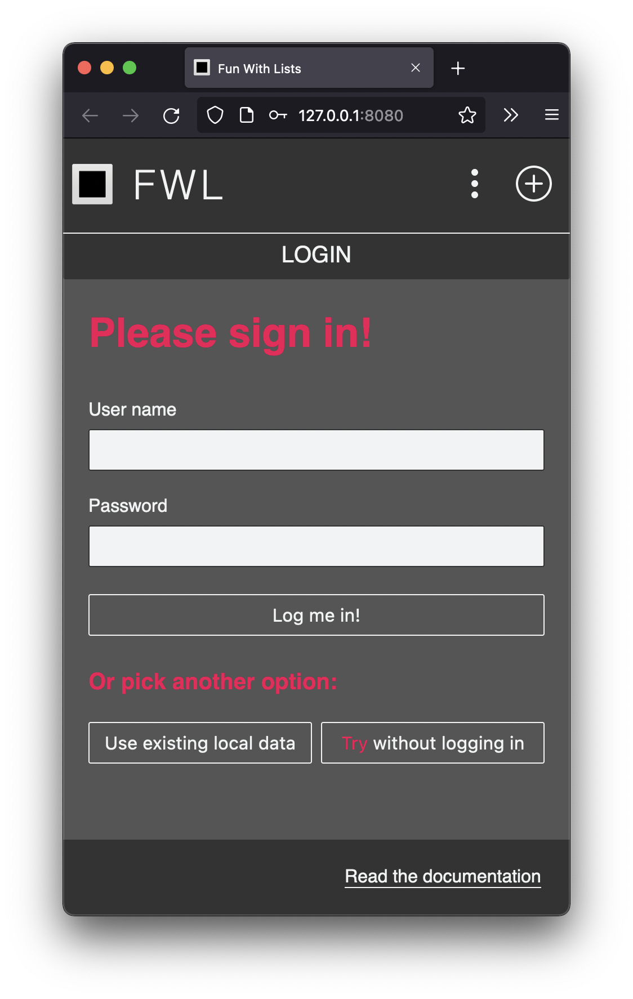
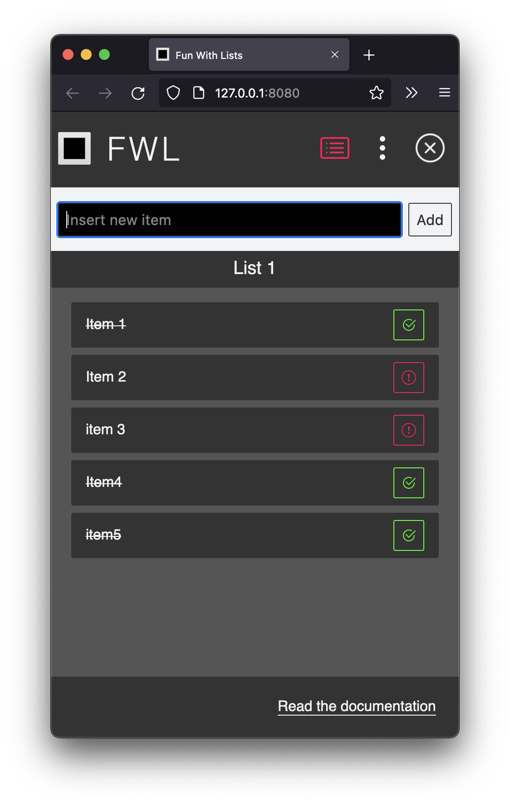

# FWL

`FWL` or `Fun With Lists` is a simple list app. You can create lists, add list items and mark them as done. List data is stored in local storage or in an [external API](https://github.com/xylnx/simple-json). The app is used a playground to learn about new things. It is written in vanilla JS.

The latest addition is a drag and drop feature, which was implemented using the [HTML drag and drop API](https://developer.mozilla.org/en-US/docs/Web/API/HTML_Drag_and_Drop_API).

Try out the [demo](https://xylnx.github.io/fwl/).

Read the [documentation](https://xylnx.github.io/fwl/docs/).

  

  

