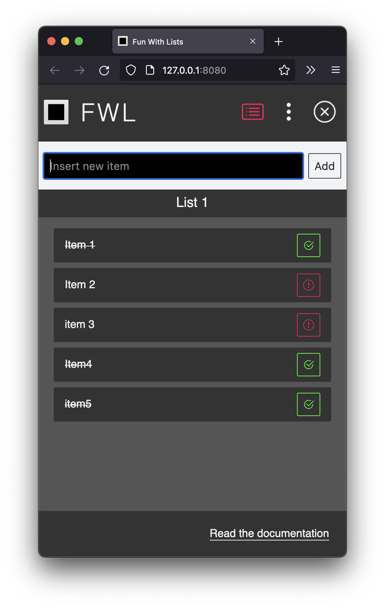

# FWL

`FWL` or `Fun With Lists` is a simple list app. You can create lists, add list items and mark them as done.

It is build in vanilla JS. List data can be stored in local storage or in an [external API](https://github.com/xylnx/simple-json).

Try out the [demo](https://xylnx.github.io/fwl/).

 
